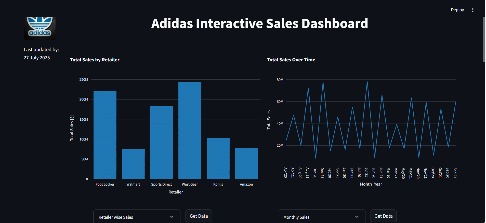

# 👟 Adidas Interactive Sales Dashboard

A visually rich and interactive sales dashboard built using **Streamlit**, **Plotly**, and **Pandas**, powered by Adidas's sales data.  
This project lets users explore sales trends, retailer performance, state-wise units sold, and region-based insights with ease.

---

## 🚀 Live App

👉 [Click here to view the live Streamlit dashboard](https://your-streamlit-link-here)  
_(Replace this with your actual Streamlit sharing link)_

---

## 📊 Features

- 📌 **Retailer-wise total sales** with interactive bar chart
- 📈 **Monthly sales trends** using line graphs
- 🏙️ **State-wise comparison** of sales and units sold (bar + line combo)
- 🌍 **Treemap visualization** by region and city
- 📥 Downloadable CSV reports for each visualization
- 📅 Real-time date of last update shown at top

---

## 📸 Dashboard Preview

### 🔹 1. Total Sales by Retailer And  Monthly Sales Trend
Visualizes which retailers generated the most sales.And Shows how sales performance evolved over different months.




---

### 🔹 3. Sales and Units Sold by State
Bar + line chart showing both sales and unit comparison state-wise.


---

### 🔹 4. Region and City-wise Treemap
A treemap that breaks down total sales by region and city.


---

## 🛠️ How to Run Locally

1. Clone the repository:
   ```bash
   git clone https://github.com/your-username/adidas-sales-dashboard.git
   cd adidas-sales-dashboard
